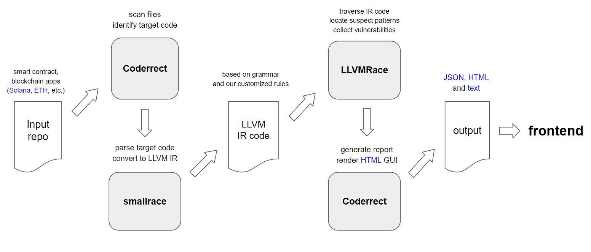

# X-Ray: Solana Programs Static Analysis Tool

## Introduction

The X-Ray Toolchain is an open-source, cross-platform command-line interface
(CLI) tool designed for static analysis of Solana programs and smart contracts
written in Rust. The tool parses Rust programs, generates an Abstract Syntax
Tree (AST), converts the AST to an LLVM Intermediate Representation (LLVM-IR)
format, and applies static analysis over the LLVM-IR to capture potential
issues.

The analysis tool is designed to be extensible, allowing developers to define
custom rules. Developers can easily describe specific rules to analyze Rust
applications via the toolchain.

### Features

TBA

### Supported Solana Bug Pattern List

The supported bug pattern list for Solana contract is saved in
[xray.json](./xray/package/conf/xray.json). The format is as below:

```
"10001": {
    "name": "ReentrancyEtherVulnerability",
    "description": "The function may suffer from reentrancy attacks due to the use of call.value ...",
    "url": "https://consensys.github.io/smart-contract-best-practices/attacks/reentrancy/"
}
```

## Installation

### Using Prebuilt Binaries

TBA

### Using Prebuilt Container Images

TBA

### Building From Source

For developers who wish to build X-Ray from source, please refer to
[Building from Source](docs/developer.md#building-from-source) for detailed
instructions.

## Usage

### Start a scan

To scan a target repository, simply clone it and run `xray` from the
project's root directory -- there's no need to locate the specific source code
files.

We use
[Solana Labs' Helloworld](https://github.com/solana-labs/example-helloworld.git)
repository as an example:

* Clone the repository

```sh
mkdir -p workspace
git clone https://github.com/solana-labs/example-helloworld.git workspace/example-helloworld
```

* Run the analysis with `xray`:

```sh
xray workspace/example-helloworld
```

* Example Output

X-Ray will report each detected potential issues along with its code snippet.
At the end of the output, X-Ray will provide a summary.

```
Analyzing /home/sec3/x-ray-toolchain/workspace/program-rust/workspace_program-rust.ll ...
Detecting Vulnerabilities
==============VULNERABLE: IntegerAddOverflow!============
Found a potential vulnerability at line 43, column 29 in workspace/program-rust/src/lib.rs
The add operation may result in overflows:
 37|        msg!("Greeted account does not have the correct program id");
 38|        return Err(ProgramError::IncorrectProgramId);
 39|    }
 40|
 41|    // Increment and store the number of times the account has been greeted
 42|    let mut greeting_account = GreetingAccount::try_from_slice(&account.data.borrow())?;
>43|    greeting_account.counter += 1;
 44|    greeting_account.serialize(&mut &mut account.data.borrow_mut()[..])?;
 45|
 46|    msg!("Greeted {} time(s)!", greeting_account.counter);
 47|
 48|    Ok(())
 49|}
>>>Stack Trace:
>>>sol.process_instruction [workspace/program-rust/src/lib.rs:19]

For more info, see https://www.sec3.dev/blog/understanding-arithmetic-overflow-underflows-in-rust-and-solana-smart-contracts

--------The summary of potential vulnerabilities in workspace_program-rust.ll--------

         1 unsafe operation issues

```

## Developer Guide

### Major Components and Workflow

#### Components and Repo Layout

The X-Ray static code anaylsis toolchain consists of three major components:

* code-parser
* code-analyzer
* CLI

#### Workflow




### Rule Engine

TBA

#### Build-in Rules

TBA

### Building from Source

Please refer to [Building from Source](docs/developer.md#building-from-source)
for detailed steps.

## Contributing

TBA
