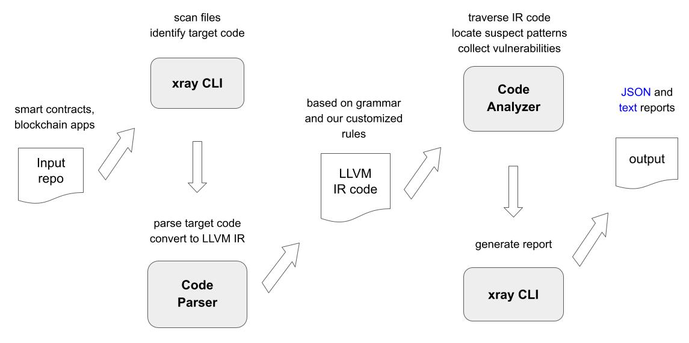

# Solana Static Analysis Tool (X-Ray Toolchain)

## Introduction

TBA

### Features

### Supported Solana Bug Pattern List

The supported bug pattern list for Solana contract is saved in [coderrect.json](./coderrect/package/conf/coderrect.json). The format is as below:

```
"10001": {
      "name": "ReentrancyEtherVulnerability",
      "description": "The function may suffer from reentrancy attacks due to the use of call.value ...",
      "url": "https://consensys.github.io/smart-contract-best-practices/attacks/reentrancy/",
      "free": true
}
```

## Installation

### Using Prebuilt Binaries

TBA

### Using Prebuilt Container Images

TBA

### Building From Source

For developers who wish to build X-Ray from source, please refer to
[Manual Installation](./README.md#manual-installation) for detailed
instructions.

## Usage

### Start a scan

In order to scan a target repository, simply clone it and run `coderrect` it in
the project's root directory (no need to look for the source code location)

As a demo, we choose [cashio](https://github.com/cashioapp/cashio), a
stablecoin based Solana, as our target repo:

```sh
git clone https://github.com/cashioapp/cashio
cd cashio
coderrect -t .
```

To see a demo result, please visit [demo result](./demo/README.md) (this demo
uses [jet-v1](https://github.com/jet-lab/jet-v1) as test target).

## Developer Guide

### Major Components and Workflow

#### Components and Repo Layout

The X-Ray static code anaylsis toolchain consists of three project repositories:

* code-parser
* code-detector
* coderrect

#### Workflow




### Flexible Rule Engine

TBA

#### Build-in Rules

TBA

### Building from Source

Please refer to [Building from Source](docs/building.md) for detailed steps.


## Contributing

TBA
