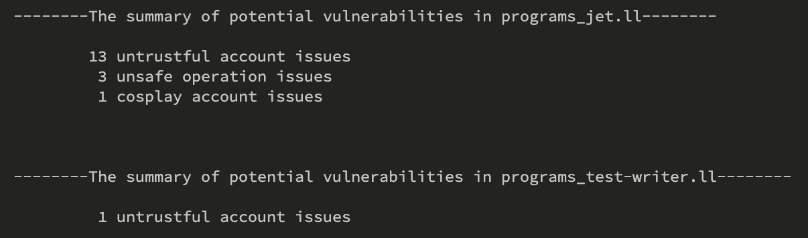
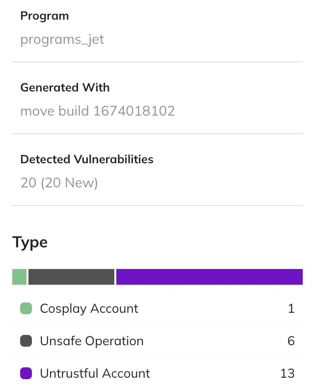
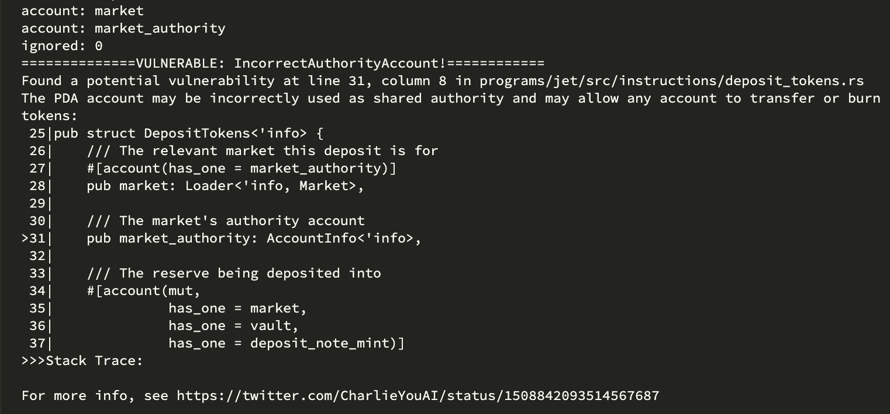
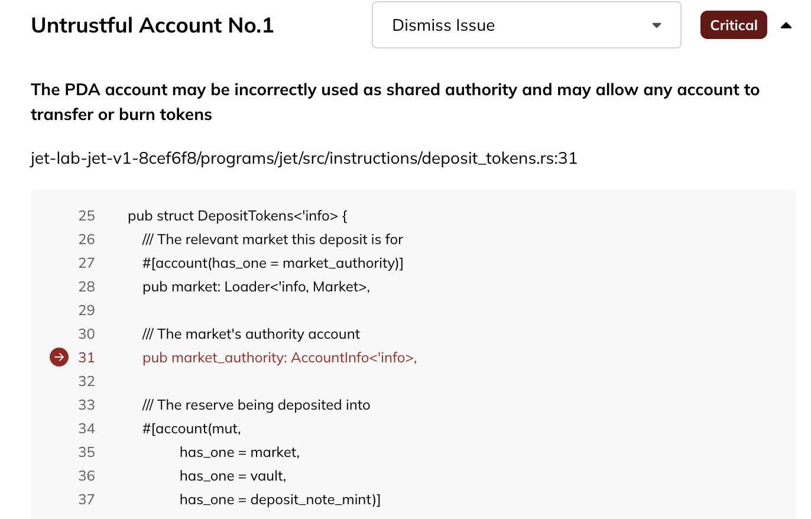

## Demo

In order to scan a target repository, simply clone it to local environment, and run `coderrect` it in the project's root directory (no need to look for the source code location)

As a demo, we choose [jet-v1](https://github.com/jet-lab/jet-v1), a smart contract on Solana, as our target repo:

```
git clone https://github.com/jet-lab/jet-v1
cd jet-v1
coderrect -t .
```
The result of command-line tool:



The result on X-ray online (same input repo):



An example of vulnerbility labeled on command-line tool:



The same vulnerbility labeled on X-ray online:


