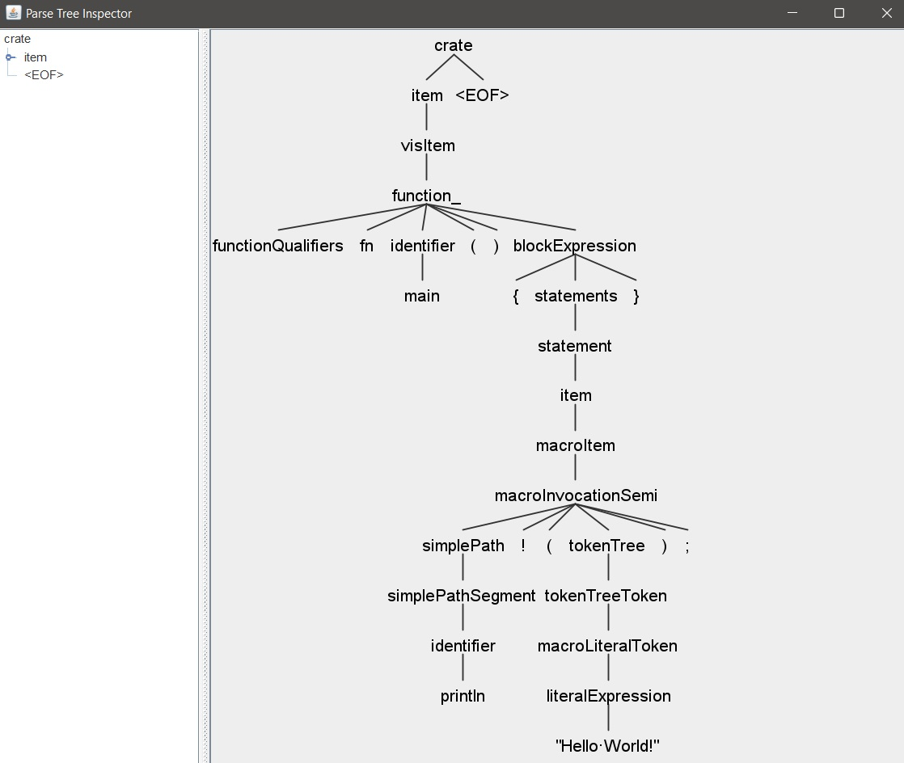

# Building smallrace

### 1. Download repo and select target language

Download the repo and switch to the target language branch (we choose Rust here for Solana apps):
```https://github.com/jinbin-coder/coderrect-instructions/tree/main/buiding-smallrace
git clone https://github.com/coderrect-inc/smallrace
cd smallrace && git checkout rust
```

### 2. Set LLVM_DIR and MLIR_DIR path

Before running cmake, you need to modify `CMakeLists.txt` to specify the LLVM_DIR path.

On `sushi` server, there's a compiled repositories ready-to-use, just add two lines in CMakeLists.txt:
```
set(LLVM_DIR /home/jeff/llvm12/llvm-project/build/lib/cmake/llvm/)
set(MLIR_DIR /home/jeff/llvm12/llvm-project/build/lib/cmake/mlir/)
```
Otherwise, add your own built LLVM repo path.

### 3. Install
```
sudo apt-get install libxml2-dev
mkdir -p build
cd build && cmake -DCMAKE_BUILD_TYPE=Release ..
make -j$(nproc)
```
Simply use `make` instead of `make -j xx` if you don't need multi-thread.

<br/>

## Troubleshooting

#### cmake error: LLVM_DIR not found
Refer to [set LLVM_DIR](../buiding-smallrace#2-set-llvm_dir-and-mlir_dir-path)


#### make error: Error 2
Makefile Error 2 means "Unknown error."
```
[ 23%] Linking CXX static library libconflib.a
[ 23%] Built target conflib
make[1]: Leaving directory 'smallrace/build'
make: *** [Makefile:130: all] Error 2
```

Solution: specify `release` when running cmake.
```
cmake --build . --target clean
cmake -DCMAKE_BUILD_TYPE=Release ..
```
Solidity version does not require it, only `cmake ..` is fine. But for the Rust version, Release must be specified.


<br/>

---

## Optional: Install ANTLR4


**Note**: smallrace is developed based on `Lexer` and `Parser` C++ code generated by ANTLR4, from a pre-defined grammar file like `Solidity.g4`. The supported grammar files list is here: https://github.com/antlr/grammars-v4/

If there is no need to make changes on `Lexer` or `Parser`, you DON'T have to install ANTLR4 tool and related dependencies (Java, etc.). 


### Configure ANTLR4

Smallrace uses ANTLR version of 4.9.

Download your prefered package from [ANTLR official site](https://github.com/antlr/antlr4/releases) 

Or download directly here: [antlr4-4.9-complete.jar](./antlr4-4.9-complete.jar)

Then configure the environment (basically PATH and alias, for ease of use)

```
export CLASSPATH=".:/usr/local/lib/antlr-4.9-complete.jar:$CLASSPATH"
alias antlr4='java -Xmx500M -cp "/usr/local/lib/antlr-4.9-complete.jar:$CLASSPATH" org.antlr.v4.Tool'
alias grun='java -Xmx500M -cp "/usr/local/lib/antlr-4.9-complete.jar:$CLASSPATH" org.antlr.v4.gui.TestRig'
```

Add the above three lines to `bashrc` to save the configuration.

### Run ANTLR4 in GUI Mode

The purpose of run ANTLR4 in GUI mode is to display the AST syntax tree in a graphical interface for testing.

As an example, we analyze  a Rust code `test_input.rs` with ANTLR4:
```
antlr4 RustLexer.g4 RustParser.g4
javac *.java
grun Rust crate -gui < test_input.rs                    
```

ANTLR4 will generate Java code of Lexer and Parser by default. If you want C++, you need to specify `-Dlanguage=cpp`.

`crate` is the entry node of Rust language. This may vary when using other programming language:
```
grun Solidity sourceUnit -gui < examples/test_input.sol     ## Solidity
grun CPP14 translationUnit -gui < test_input.cpp            ## C++
```
The GUI of syntax tree looks like:


